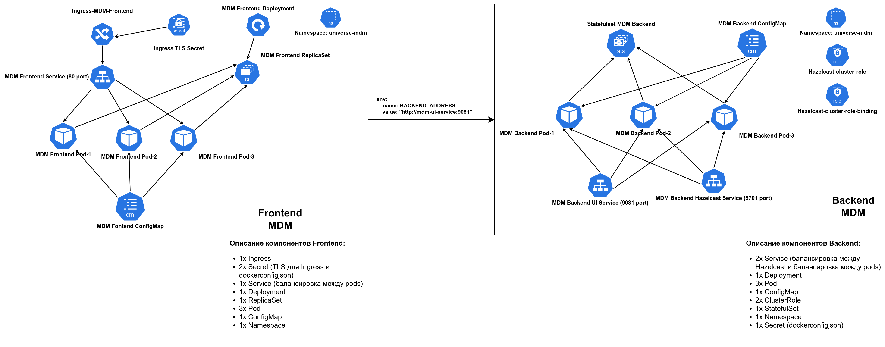
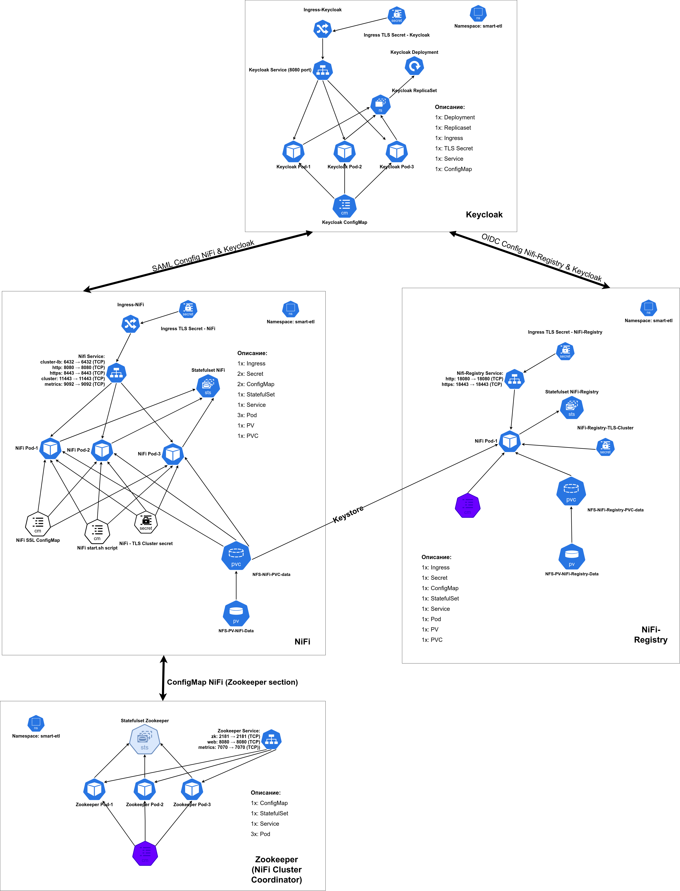
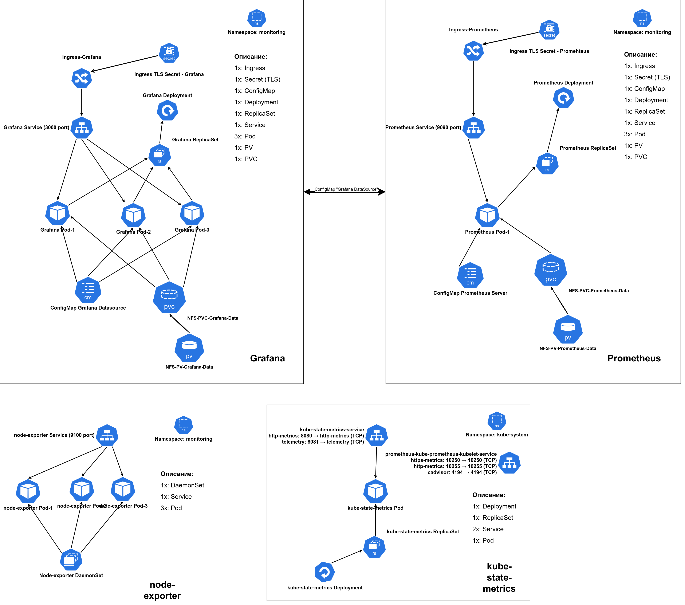

# Где искать документацию

В каждом отдельном каталоге лежит свой ReadMe.md, где описано назначение компонентов и процесс развёртывания.

- `Manifests` - содержит основные манифесты комопонетов SmartETL и Universe MDM и их мониторинга;
- `Helm` - содержим Helm чарты для установки MDM, SmartETL и мониторинга компонентов (рекомендуемый способ установки)
- `Helm-Blue-Green-Strategy` - содержит Helm чарты для реализации стратегии Blue/Green
- `Helm-with-Vault` - содержит Helm чарты, которые можно установить применяя для хранения секретов HashiCorp Vault
- `draw.io` - содержит исходик схем для приложений.
- `grafana-docker-patch` - содержит Dockerfile для сборки образа Grafana с дополнительными плагинами.
- `ci-docker` - содержит Dockerfile для сборки образа предназначенного для CI/CD (вшиты утилиты Helm и kubectl).
- `ci` - содержит скрипты, которые используются для построения CI/CD
- `k8s-dashboard` - содержит компоненты Dashboard kubernetes;

# Стенд с Kubernetes

Инфраструктура стендов с Kubernetes описана здесь: <https://confluence.unidata-platform.com/display/DEVOPS/Kubernetes+cluster>

# Доступность работающих на стендах сервисов

### **NiFi:**

<https://your_domain/nifi/>
Login: `admin`
Password: `admin`

### **NiFi-Registry:**

<https://your_domain/nifi-registry/>
Login: `admin`
Password: `admin`

### **Keycloak:**

<https://your_domain/keycloak/auth/>
Login: `admin`
Password: `admin`

### **MDM:**

<https://your_domain/>
Login: `admin`
Password: `admin`

### **Prometheus:**

<https://prometheus.your_domain/>

### **Grafana:**

<https://grafana.your_domain/>
Login: `admin`
Password: `qy3YpQU28KKias`

# Cхема приложения

# MDM

## Cхема приложения



### Описание

Компоненты приложения MDM Frontend и MDM Backend разворачиваются отдельно.

#### Связи

Связь между компонентами задаётся в манифесте Deployment Frontend в переменной:

```yaml
- name: BACKEND_ADDRESS
  value: "http://mdm-ui-service:9081"
```

Которая указывает на сущность `mdm-service-ui` на порт 9081 компонента backend.

#### Используемые образы

Для компонента Frontend:

```
  repository: docker.universe-data.ru/unidata-ee/frontend
  tag: "release-6-11-df1431a6"
```

Для компонента Backend:

```
  repository: docker.universe-data.ru/unidata-ee/backend
  tag: "release-6-11-f8cef2ba"
```

#### Оценка требуемых ресурсов

Все выделенные ресурсы можно корректировать в `values.yaml`, которые находятся в Helm чартах.

Рекомендованные значения ресурсов для MDM могут варьироваться в зависимости от конкретной нагрузки, количества пользователей и других факторов. Однако, на основании общих рекомендаций и типичных сценариев использования, можно установить следующие значения:

Для Backend:

```yaml
resources:
  requests:
    cpu: 2000m
    memory: 4Gi
    ephemeral_storage: "2Gi"
  limits:
    cpu: 2000m
    memory: 8Gi
    ephemeral_storage: "3Gi"
```

Для Frontend:

```yaml
resources:
  requests:
    cpu: 800m
    memory: 1024Mi
    ephemeral_storage: "500Mi"
  limits:
    cpu: 800m
    memory: 1638Mi
    ephemeral_storage: "800Mi"
```

#### Сущности

##### Backend

###### config-map-be.yaml

Этот манифест Kubernetes описывает ConfigMap с именем `config-universe-mdm-backend`. ConfigMap хранит конфигурационные параметры для приложения backend MDM. Эти параметры включают настройки подключения к базе данных PostgreSQL, параметры подключения к кластеру поиска Opensearch, параметры электронной почты, опции кэширования и другие системные настройки. ConfigMap используется для конфигурирования приложения без необходимости вносить изменения в его код.

###### hazelcast-cluster-role-binding.yaml

Этот манифест Kubernetes описывает объект ClusterRoleBinding, который связывает ClusterRole с ServiceAccount, предоставляя ему определенные разрешения на уровне кластера.

###### hazelcast-cluster-role.yaml

Этот манифест Kubernetes описывает ClusterRole с именем `hazelcast-cluster-role`. ClusterRole определяет набор разрешений для доступа к различным ресурсам в кластере. В данном случае, разрешения включают чтение (`get`, `list`) и наблюдение (`watch`) за ресурсами, такими как endpoints, pods, nodes, services и statefulsets из API групп `""` и `apps`, а также за endpointslices из API группы `discovery.k8s.io`. Эти разрешения необходимы для поддержки автоматического управления состоянием кластера Hazelcast, особенно при включенной функции hot-restart (горячий перезапуск).

###### mdm-service.yaml

Этот манифест Kubernetes определяет службу с именем "mdm-service", предоставляющую доступ к hazelcast приложения "universe-mdm-backend" через порт TCP 5701.

###### mdm-statefulset.yaml

Это основной манифест, который описывает конфигурацию Kubernetes для StatefulSet. Манифест содержит информацию о параметрах, таких как количество реплик, конфигурация контейнеров, сетевая конфигурация и т.п.

###### mdm-ui-service.yaml

Этот манифест Kubernetes определяет службу с именем "mdm-ui-service", которая обеспечивает доступ к интерфейсу пользователя (UI) приложения "universe-mdm-backend" через порт TCP 9081. Сессионная аффинность настроена на "ClientIP" с таймаутом в 600 секунд. Именно на этот Service обращается Frontend часть приложения.

###### secret.yml

Манифест, который описывает secret для получения образа контейнера backend из приватного репозитория.

##### Frontend

###### config-map-fe.yaml

Этот манифест Kubernetes определяет ConfigMap с именем "universe-mdm-frontend-configmap", содержащий файл настроек "customer.json". В этом файле определены параметры конфигурации для приложения, такие как тип приложения, URL сервера, лимит выбора массовой загрузки и другие настройки.

###### ingress.yaml

Этот манифест Kubernetes определяет Ingress для маршрутизации HTTP-трафика к сервису "universe-mdm-frontend-service". Он настроен на принятие запросов для указанного хоста. Также определено использование TLS с сертификатом "universe-mdm-frontend-tls" для безопасной передачи данных.

###### secret.yml

Этот манифест Kubernetes определяет секрет с именем "universe-mdm-frontend-tls" для использования в Ingress в приложении "universe-mdm-frontend". Нужно для SSL соеднинения с приложением.
Помимо этого, ниже описан манифест, который описывает secret для получения образа контейнера backend из приватного репозитория.

###### ui-deployment.yaml

Это основной манифест, который описывает конфигурацию Kubernetes для Deployment. Манифест содержит информацию о параметрах, таких как количество реплик, конфигурация контейнеров, сетевая конфигурация и т.п.

###### ui-service.yaml

Этот манифест Kubernetes определяет службу с именем "universe-mdm-frontend-service", которая использует тип LoadBalancer для балансировки нагрузки трафика на порту 80.

# SmartETL

## Схема приложения



### Описание

Компоненты приложения такие как Keycloak, NiFi и NiFi-registry разворачиваются отдельно.

#### Связи

Связь между компонентами задаются в configmap каждого компонента и донастраиваются в UI в соответствии в документацией.

#### Используемые образы

Для компонента Keycloak:

```
image:
  repository: docker.universe-data.ru/smart-etl/keycloak
  tag: "21.1.1"

```

Для компонента NiFi:

```
    repository: docker.universe-data.ru/smart-etl/apache/nifi
    tag: "1.24.0"

    repository: docker.universe-data.ru/smart-etl/busybox
    tag: "1.36"

 repository: docker.universe-data.ru/smart-etl/zookeeper
    tag: "3.8"
```

Для компонента NiFi-Registry:

```
image:
  repository: docker.universe-data.ru/smart-etl/apache/nifi-registry-your_domain-key
  tag: "1.24.0"
```

#### Оценка требуемых ресурсов

Все выделенные ресурсы можно корректировать в `values.yaml`, которые находятся в Helm чартах.

##### Keycloak

Рекомендованные значения ресурсов для Keycloak могут варьироваться в зависимости от конкретной нагрузки, количества пользователей и других факторов. Однако, на основании общих рекомендаций и типичных сценариев использования, можно установить следующие значения:

```yaml
resources:
  requests:
    cpu: 500m
    memory: 2Gi
  limits:
    cpu: 1
    memory: 4Gi
```

##### NiFi

Эта конфигурация предоставит больше ресурсов для выполнения потоков данных и обработки больших объемов данных, а также обеспечит большую гибкость и устойчивость при изменении нагрузки. Однако может быть увеличена в зависимости от нагрузки.

```yaml
resources:
  requests:
    cpu: 1000m
    memory: 8Gi
  limits:
    cpu: 2000m
    memory: 16Gi
nifi_jvm_heap_init: "4g"
nifi_jvm_heap_max: "8g"
```

PV:

Настройка выделяемого пространства для NiFi настраивается здесь. Стоит учитывать, что нужно выделить достаточное количество пространство, так как PVC нельзя будет расширить, и данные надо будет переносить на новый PV:

```YAML
  volumes:
    nfs:
      path: /var/nfs/nifi-cluster/
      server: 10.21.2.33
      storage: 300Gi
      nfsvers: "4.0"
```

##### Zookeeper

Эта конфигурация предоставит больше ресурсов для работы ZooKeeper, что особенно важно для обеспечения надежности и стабильности в производственных средах с высокой нагрузкой. Однако может быть увеличена в зависимости от нагрузки.

```yaml
resources:
  requests:
    cpu: 500m
    memory: 1024Mi
  limits:
    cpu: 1000m
    memory: 2048Mi
```

##### NiFi-Registry

Эта конфигурация предоставит больше ресурсов для работы NiFi-Registry, что особенно важно для обеспечения надежности и стабильности в производственных средах с высокой нагрузкой. Однако может быть увеличена в зависимости от нагрузки.

```yaml
resources:
  requests:
    cpu: 500m
    memory: 4Gi
  limits:
    cpu: 1000m
    memory: 6Gi
```

Настройка выделяемого пространства для NiFi-Registry настраивается здесь. Стоит учитывать, что нужно выделить достаточное количество пространство, так как PVC нельзя будет расширить, и данные надо будет переносить на новый PV:

```YAML
volumes:
  nfs:
    path: /var/nfs/nifi-registry/
    server: 10.21.2.33
    storage: 200Gi
    nfsvers: "4.0"

```

#### Сущности

##### NiFi

###### nifi-ingress.yml

Этот манифест представляет собой настройку Ingress в Kubernetes для приложения NiFi. Ingress - это объект Kubernetes, который управляет доступом к службам в кластере из внешних сетей. В данном случае:

- Определено имя Ingress и метки для идентификации.
- Указаны аннотации для настройки Nginx Ingress Controller, включая настройки для проксирования SSL и управления балансировкой нагрузки.
- Заданы параметры TLS для обеспечения безопасного соединения с хостом с использованием сертификата, сохраненного в секрете "nifi-tls".
- Определены правила маршрутизации, указывающие на сервис NiFi для пути /nifi на порту 8443.
- Указано имя класса Ingress, используемого для управления маршрутизацией (в данном случае - nginx).

###### nifi-start-configmap.yml

Этот манифест представляет собой скрипт `start.sh`, который используется для запуска приложения NiFi в контейнере. В скрипте:

- Определены переменные окружения и настройки для создания необходимых каталогов и установки различных параметров приложения.
- Установлены параметры JVM для задания размеров кучи и отладочных настроек.
- Настроены пути к файлам конфигурации, включая файлы потоков, идентификации пользователя и другие настройки.
- Заданы параметры сети, такие как хосты и порты.
- Выполнены операции по настройке безопасности, включая поддержку протоколов SSL/TLS и настройки аутентификации (SAML, OIDC, LDAP).
- Запущен NiFi, создан процесс для непрерывного отображения журнала и установлены обработчики сигналов для корректного завершения работы приложения.

Этот скрипт обеспечивает запуск и настройку приложения NiFi в контейнерной среде Kubernetes, обеспечивая его готовность к приему и обработке данных.

###### nifi-cluster-secret.yml

Этот секрет для Kubernetes имеет тип `kubernetes.io/tls` и имя `nifi-cluster-secret`. Он содержит два зашифрованных элемента данных: `tls.crt` и `tls.key`.

Предназначен для SSL взаимодействия между pod NiFi.

###### nifi-secrets.yml

Этот секрет для Kubernetes имеет тип `kubernetes.io/tls` и имя `nifi-cluster-secret`. Он содержит два зашифрованных элемента данных: `tls.crt` и `tls.key`.

Предназначен для SSL взаимодействия с NiFi-Ingress.

###### nifi-statefulset.yml

Этот манифест описывает конфигурацию Kubernetes для StatefulSet под названием "nifi", который представляет собой составную часть "smartetl". Манифест содержит информацию о параметрах, таких как количество реплик, конфигурация контейнеров, сетевая конфигурация, привязка к ресурсам хранилища и т. д.

###### nifi-configmap.yml

Этот манифест представляет собой конфигурационный файл ConfigMap в Kubernetes для приложения NiFi. ConfigMap используется для хранения нечувствительных к безопасности конфигурационных данных, которые могут быть использованы в приложениях. В данном случае:

- Определены различные переменные среды и параметры конфигурации, такие как домен, настройки безопасности, пути к ключам и хранилищам, настройки кластера, параметры JVM, параметры аутентификации, порты и многое другое.
- Заданы значения для этих параметров, включая URL-адреса, пароли, типы хранилищ, интервалы времени и другие.
- Определены настройки для SAML-аутентификации, сетевых соединений, секретных ключей, параметров доступа и многое другое.

Этот ConfigMap служит для централизованного управления конфигурацией NiFi в Kubernetes, что обеспечивает легкость в обновлении и масштабировании приложения.

###### nifi-service.yml

Этот манифест описывает конфигурацию Kubernetes для службы (Service) под названием "nifi". Сервис "nifi" будет обслуживать трафик для приложения с меткой "app: nifi". Он настроен с типом ClusterIP для доступа внутри кластера. Также определена сессионная аффинность по клиентскому IP с таймаутом в 600 секунд. Селектор соответствует метке "app: nifi". Порты указаны для проброса трафика внутрь контейнеров, например, порты 8080, 8443, 11443, 6432 и 9092, соответственно.

###### nifi-storage.yaml

Этот манифест описывает настройку постоянного тома (PersistentVolume) под названием "nfs-pv-nifi-data". Том настроен для доступа к хранилищу NFS на сервере Размер задаётся в values.yaml Helm чарта манифестаа. Указаны режимы доступа ReadWriteMany и ReadOnlyMany. Политика восстановления persistentVolumeReclaimPolicy установлена на Recycle. Политикой Helm чарта запрещено удаление PV и PVC при удалении приложения.

###### nifi-hpa.yml

Этот манифест описывает настройку горизонтального масштабирования (HorizontalPodAutoscaler) для StatefulSet с именем "nifi". Приложение будет масштабироваться автоматически в зависимости от загрузки ресурсов.

###### nifi-ssl-configmap.yml

Этот манифест определяет ConfigMap, содержащий скрипт безопасности (security.sh) для настройки SSL в NiFi. Скрипт использует переменные окружения и команды TLS Toolkit для создания и настройки сертификатов. Он также копирует созданные ключи и сертификаты в указанные места внутри контейнера NiFi. После этого он выполняет импорт сертификата Keycloak в хранилища ключей и доверенных хранилищ, используя утилиту keytool.

###### regcred.yaml (опционально)

Манифест, который создаёт секрет для доступа в приватное хранилище образов

###### zk-zookeeper.yml

Этот манифест Kubernetes описывает StatefulSet для развертывания сервиса ZooKeeper. StatefulSet создаёт три реплики подов ZooKeeper с именем `zookeeper`, которые запускаются поочерёдно и сохраняют уникальные сетевые идентификаторы. В каждом поде запускается контейнер с образом ZooKeeper версии 3.8, который слушает порты для соединений клиентов и HTTP-запросов. Манифест включает пробы живучести и готовности, а также использует ConfigMap для конфигурации и emptyDir для временного хранения данных.

###### zk-configmap.yml

Этот манифест Kubernetes описывает ConfigMap с именем `zookeeper-cm`. ConfigMap хранит конфигурационные параметры для сервиса ZooKeeper, такие как разрешение анонимного входа, настройки автоподдержки, параметры синхронизации, и дополнительные конфигурации для метрик Prometheus. Эти параметры используются для настройки поведения ZooKeeper.

###### zkserver.sh.yml

Этот манифест Kubernetes описывает ConfigMap, который содержит скрипт `zkServer.sh` для управления сервером ZooKeeper. Скрипт поддерживает несколько команд для запуска, остановки, перезапуска, проверки версии и статуса сервера ZooKeeper, а также для печати командной строки запуска. Он включает в себя настройки для JMX, конфигурации JVM и различные параметры, необходимые для правильного функционирования сервера ZooKeeper.

###### zk-service.yml

Этот манифест Kubernetes описывает Service с именем `zookeeper`. Service предоставляет доступ к подам ZooKeeper через внутренний IP-адрес (ClusterIP). Он маршрутизирует трафик по трём портам: 2181 для основного сервиса ZooKeeper, 8080 для веб-интерфейса и 7070 для метрик. Service использует селектор для определения подов ZooKeeper на основе метки `app: zookeeper`.

##### NiFi-Registry

###### configmap.yml

Этот манифест Kubernetes определяет ConfigMap с именем "nifi-registry-cm", который содержит различные параметры конфигурации для приложения NiFi Registry. В нем определены переменные среды, адреса базы данных, параметры безопасности, пути к хранилищам ключей и другие настройки. Например, здесь определены параметры для подключения к базе данных PostgreSQL, пути к хранилищам ключей и пароли к ним, а также параметры безопасности OIDC (OpenID Connect) для аутентификации пользователей.

###### hpa.yml

Этот манифест Kubernetes определяет горизонтальный автомасштабировщик (HorizontalPodAutoscaler, HPA) для NiFi Registry.

Он настроен для масштабирования целевого объекта типа StatefulSet с именем "nifi-registry".

Минимальное количество реплик установлено на 1, а максимальное также на 1, что означает, что количество реплик не будет автоматически увеличиваться или уменьшаться выше или ниже этого значения. **На данный момент не поддерживается запуск этого приложения более чем с 1 репликой**

Определено поведение для масштабирования: после масштабирования вверх будет период стабилизации в 300 секунд (5 минут).

В качестве метрик для масштабирования используются ресурсы CPU и памяти. Задано, что средняя утилизация каждого из этих ресурсов должна составлять 90%.

###### ingress.yml

Этот манифест Kubernetes определяет Ingress для NiFi Registry. Ingress называется "nifi-registry" и связывается с сервисом "nifi-registry" на порту 18443. Он настроен для работы с SSL-Passthrough и использует cookie-аффинити. Указаны правила маршрутизации, связывающие хост с сервисом NiFi Registry.

###### nifi-registry.yml

Этот манифест Kubernetes определяет StatefulSet для NiFi Registry. StatefulSet называется "nifi-registry" и имеет метки "name: nifi-registry" и "app: nifi-registry". Он также включает определение контейнера для NiFi Registry, определяющее настройки контейнера, такие как образ, переменные среды, монтирование томов и ресурсы.

###### regcred.yaml

В этом манифесте описан secret для получения доступа к приватному репозиторию образов контейнера.

###### secrets.yml

Этот манифест Kubernetes определяет секрет с именем "nifi-registry-cluster-secret", который содержит TLS-сертификат и закрытый ключ. Этот секрет используется для обеспечения безопасного соединения в Kubernetes, для Ingress контроллера и SSL соеднинения в самом приложениии.

###### service.yml

Этот манифест Kubernetes определяет службу (Service) для NiFi Registry.

Служба называется "nifi-registry" и имеет метки "app: nifi-registry". Она также содержит аннотации, указывающие, что она является частью приложения "nifi-registry".

Тип службы установлен как ClusterIP, что означает, что служба доступна только внутри кластера Kubernetes.

Настройки аффинности сессии указывают, что сессионная аффинность основана на IP-адресе клиента и должна длиться до 600 секунд.

Селектор определяет, что служба направляет трафик на поды с меткой "app: nifi-registry".

Служба открывает порты 18080 и 18443 для TCP-трафика. Порт 18080 предназначен для HTTP-соединений, а порт 18443 для HTTPS-соединений. Оба порта направляют трафик на соответствующие целевые порты на подах, связанных с NiFi Registry.

###### start-configmap.yml

Этот манифест Kubernetes определяет ConfigMap с именем "start-nr.sh", который содержит скрипт запуска для приложения NiFi Registry. В скрипте определены различные настройки, такие как порты HTTP, параметры безопасности, настройки базы данных и другие параметры конфигурации. Скрипт также определяет способы аутентификации пользователей в зависимости от значения переменной AUTH (tls, ldap, oidc).

Скрипт также запускает NiFi Registry и непрерывно предоставляет журналы для возможности их просмотра с помощью 'kubectl logs'.

###### storage.yaml

Этот манифест Kubernetes определяет PersistentVolume (PV) и PersistentVolumeClaim (PVC) для хранения данных NiFi Registry.

PV (nfs-pv-nifi-registry-data) представляет собой ресурс хранения, который использует протокол NFS для доступа к хранилищу данных. Он настроен для многократной записи и чтения и имеет политику восстановления Recycle.

PVC (nfs-pvc-nifi-registry-data) представляет собой запрос на выделение ресурса хранения, соответствующего PV. Он использует класс хранилища nfs с доступом для многих пользователей на чтение и запись.

##### Keycloak

###### configmap.yaml

Этот манифест Kubernetes определяет ConfigMap для Keycloak, который содержит различные настройки конфигурации. В нем определены переменные окружения для настройки администратора, настройки прокси, настройки базы данных PostgreSQL, настройки кэша и другие параметры. Некоторые строки закомментированы, что указывает на возможность использования кастомных сертификатов TLS для HTTPS.

###### deployment.yaml

Этот манифест Kubernetes определяет развертывание (Deployment) для Keycloak. Здесь настраивается развертывание реплик, указывается образ контейнера Keycloak , который должен быть загружен из репозитория docker.universe-data.ru. Контейнеру Keycloak передаются аргументы "start" и "--cache-stack=kubernetes". Он также настроен на использование ConfigMap "keycloak-cm" для загрузки переменных окружения.

Контейнер прослушивает порты 8080 (http) и 7600 (jgroups). Для проверки готовности контейнера настроена проверка доступности по HTTP-маршруту /auth/health/ready через порт 8080, начиная через 60 секунд после запуска и повторяющаяся каждые 5 секунд.

Также установлены ресурсы для контейнера: запросы на использование процессора (500m CPU) и памяти (2Gi), а также лимиты по использованию процессора (1 CPU) и памяти (4Gi).

###### ingress.yaml

Этот манифест Kubernetes определяет Ingress для маршрутизации внешних запросов к службе Keycloak, доступной по хосту. Ingress настроен для использования NGINX Ingress Controller и обеспечивает защищенное соединение с использованием TLS. Все запросы, соответствующие пути `/keycloak/*`, будут направляться на службу Keycloak, работающую на порту 8080.

###### regcred.yaml

В этом манифесте описан secret для получения доступа к приватному репозиторию образов контейнера.

###### secret.yaml

Этот манифест Kubernetes определяет секрет "keycloak-tls", который содержит сертификат TLS для Keycloak. Он используется для обеспечения безопасного соединения с Keycloak через HTTPS. Секрет содержит закодированный сертификат (tls.crt) и закодированный закрытый ключ (tls.key).

###### service.yaml

Этот манифест Kubernetes определяет службу с именем "keycloak". Служба работает на порту 8080 и использует селектор для нахождения подов, связанных с меткой "app: keycloak". Сессионная аффинность установлена на клиентский IP-адрес. Тип службы установлен как ClusterIP, а IP-адрес кластера установлен на None, что означает, что служба не будет доступна внутри кластера по IP-адресу.

# Мониторинг

## Схема приложения



### Описание

Компоненты Prometheus, Grafana, node-exporter и kube-state-metrics, а так же мониторинг приложений контейнера разворачиваются отдельно в соответствии с документацией.

#### Связи

Связь между компонентами задаются в configmap манифестов в соответствии с документацией по установке.

#### Используемые образы

Для компонента kube-state-metrics:

```
repository: docker.universe-data.ru/smart-etl/monitoring/kube-state-metrics
tag: "v2.3.0"
```

Для компонента Grafana:

```
repository: docker.universe-data.ru/smart-etl/monitoring/grafana
tag: "10.4.3"
```

Для компонента node-exporter:

```
repository: docker.universe-data.ru/smart-etl/monitoring/prom/node-exporter
tag: "latest"
```

Для компонента Prometheus:

```
  repository: docker.universe-data.ru/smart-etl/monitoring/prom/prometheus
  tag: "latest"

```

#### Оценка требуемых ресурсов

Все выделенные ресурсы можно корректировать в `values.yaml`, которые находятся в Helm чартах.

##### Prometheus

Рекомендованные значения ресурсов для комонентов мониторинг могут варьироваться в зависимости от конкретной нагрузки, количества метрик, отдаваемых Prometheus и других факторов. Основные требования предьявляются в хранилищу данных. Стоит понимать, что по умолчанию Prometheus хранит метрики 15 дней. Следовательно нужно рассчитать размер хранилища ровно под эти параметры.
Например, в данном случае Prometheus будет писать метрик ~4Gb в день, следовательно нужно эту величину умножить на 15.

$4096*15=61440$ mb

Дополнительно стоит взять запас для новых метрик ~ 20% `73Gb`

Итого возьмём 80ГБ, с учётом того, что у нас достаточно мало метрик.

На основании общих рекомендаций и типичных сценариев использования, можно установить следующие значения:

```yaml
volumes:
  nfs:
    path: /var/nfs/prometheus-data/
    server: 10.21.2.33
    storage: 80Gi
    nfsvers: "4.0"
```

##### Grafana

Рекомендации могут зависеть от нагрузки на вашу систему и объема данных, с которыми вы работаете. Вот несколько рекомендаций:

1. **Мониторинг использования ресурсов**: После запуска Grafana, следите за использованием ресурсов. Если обнаружите, что текущие ресурсы недостаточны или избыточны, вы можете вносить соответствующие изменения в конфигурацию.

2. **Управление данными**: Учитывайте размеры и объемы данных, с которыми будет работать Grafana. Если у вас большой объем данных, возможно, вам потребуется увеличить выделенный объем хранилища. Также учтите, что рост данных со временем может потребовать дополнительных ресурсов.

3. **Масштабирование**: Если ваша нагрузка на Grafana растет, вам может потребоваться масштабировать ресурсы вверх. Это может включать увеличение выделенной памяти, CPU или хранилища.

4. **Оптимизация запросов и панелей**: Иногда оптимизация запросов к базам данных или оптимизация настроек панелей в Grafana может снизить нагрузку на систему и требуемые ресурсы.

5. **Мониторинг производительности**: Установите метрики производительности Grafana и мониторьте их, чтобы выявить узкие места или проблемы производительности, которые могут потребовать дополнительных ресурсов или оптимизации.

На основании общих рекомендаций и типичных сценариев использования, можно установить следующие значения:

```yaml
volumes:
  nfs:
    path: /var/nfs/grafana-data/
    server: 10.21.2.33
    storage: 50Gi
    nfsvers: "4.0"

resources:
  limits:
    memory: "1Gi"
    cpu: "1000m"
  requests:
    memory: 500M
    cpu: "500m"
```

##### Node-exporter

По умолчанию большинство кластеров Kubernetes предоставляет метрики сервера метрик (метрики на уровне кластера из API-резюме) и Cadvisor (метрики на уровне контейнеров). Он не предоставляет подробных метрик на уровне узлов.
Данный компонент не потребляет много ресурсов и может ограничится следующими значениями:

```yaml
resources:
  limits:
    cpu: 250m
    memory: 180Mi
  requests:
    cpu: 102m
    memory: 180Mi
```

##### kube-state-metrics

Kube State Metrics — это сервис, который взаимодействует с сервером API Kubernetes, чтобы получить всю информацию обо всех API-объектах, таких как деплойменты, поды, daemonset, Statefulset и другие.
Для данного компонента выделение особенных ресурсов не предусмотрено, так как он не требует какого-то значительного количества ресурсов.

#### Сущности

##### Prometheus

###### clusterRole.yaml

Этот манифест Kubernetes определяет ClusterRole с именем "prometheus", который предоставляет разрешения на чтение (get), перечисление (list) и наблюдение (watch) для различных ресурсов Kubernetes, необходимых Prometheus для мониторинга:

1. Ресурсы API группы "" (являются ресурсами ядра Kubernetes):

   - nodes
   - nodes/proxy
   - services
   - endpoints
   - pods

2. Ресурсы API группы "extensions":

   - ingresses

3. Не ресурсные URL, такие как "/metrics", для получения метрик.

Эти разрешения позволяют Prometheus собирать данные мониторинга из различных источников в кластере Kubernetes.

###### prometheus-deployment.yaml

Этот манифест Kubernetes определяет развертывание Prometheus в пространстве имен "monitoring".

###### prometheus-service.yaml

Этот манифест Kubernetes определяет службу с именем "prometheus-service" в пространстве имен "monitoring". Некоторые аннотации предоставляют информацию для Prometheus о том, какие службы должны быть собраны и на каком порту. Вот краткое описание:

- **prometheus.io/scrape: "true"**: Эта аннотация сообщает серверу Prometheus, что он должен собирать метрики с этой службы.
- **prometheus.io/port: "9090"**: Эта аннотация указывает порт, на котором служба должна быть собрана.

Спецификация службы также включает селектор, который указывает на метки pod'ов, к которым должны быть направлены запросы, тип службы (LoadBalancer) и конфигурацию портов. В данном случае, служба "prometheus-service" будет доступна через LoadBalancer на порту 9090 и будет направлять трафик на pod'ы с меткой "app: prometheus-server".

###### regcred.yaml

В этом манифесте описан secret для получения доступа к приватному репозиторию образов контейнера.

###### config-map.yaml

Этот манифест Kubernetes определяет ConfigMap с именем "prometheus-server-conf" в пространстве имён "monitoring". ConfigMap содержит конфигурацию Prometheus, включая правила и файл конфигурации prometheus.yml.

В файле prometheus.yml определены следующие настройки:

- Глобальные параметры scrape_interval и evaluation_interval.
- Пути к правилам в rule_files.
- Настройки scrape_configs для сбора метрик от различных источников:
  - node-exporter
  - kubernetes-apiservers
  - kubernetes-nodes
  - kubernetes-pods
  - kube-state-metrics
  - kubernetes-cadvisor
  - kubernetes-service-endpoints
  - nifi-pods
  - zookeeper-nifi-pods
  - keycloak-pods
  - postgres-endpoint
  - opensearch

###### prometheus-ingress.yaml

Этот манифест Kubernetes определяет секрет с именем "prometheus-secret-tls" в пространстве имён "monitoring". Секрет содержит сертификат TLS и ключ TLS, закодированные в формате base64. А также содержит саму конфигурацию Ingress для Prometheus.

###### prometheus-storage.yaml

Этот манифест Kubernetes определяет PersistentVolume (PV) и PersistentVolumeClaim (PVC) для хранения данных Prometheus.

PV с именем "nfs-pv-prometheus-server-data" использует хранилище NFS с общим доступом на чтение и запись.
PVC с именем "nfs-pvc-prometheus-server-data" запрашивает доступ к PV "nfs-pv-prometheus-server-data" для хранения данных. Он также использует хранилище NFS с общим доступом на чтение и запись

Оба ресурса имеют аннотации `"helm.sh/resource-policy": keep`, что означает, что они должны оставаться в кластере даже после удаления Helm-чарта.

##### Grafana

###### deployment.yaml

Этот манифест Kubernetes определяет развертывание Grafana в кластере

###### grafana-datasource-config.yaml

Этот манифест Kubernetes определяет ConfigMap для настройки источника данных Grafana, который связывает Grafana с Prometheus.

- **Тип ресурса**: ConfigMap.

- **Имя**: "grafana-datasources".

- **Пространство имен**: "monitoring".

- **Данные**:

  - **prometheus.yaml**: Содержит конфигурацию источника данных Prometheus для Grafana. Это JSON-представление с настройками доступа к источнику данных, включая имя, тип, URL и другие параметры.

###### grafana-ingress.yaml

Этот манифест Kubernetes определяет ингресс для доступа к интерфейсу Grafana через HTTP/HTTPS в пространстве имен "monitoring".

Также манифест Kubernetes определяет секрет для использования в поддержке TLS (Transport Layer Security) для сервиса Grafana в пространстве имен "monitoring".

- **Тип секрета**: Secret типа kubernetes.io/tls.

- **Содержание**: Содержит закодированные сертификаты TLS (tls.crt) и закрытый ключ TLS (tls.key). Данные сертификата и ключа представлены в формате base64.

Этот секрет будет использоваться для настройки безопасного соединения для сервиса Grafana в кластере Kubernetes.

###### grafana-storage.yaml

Этот манифест Kubernetes определяет PersistentVolume (PV) и PersistentVolumeClaim (PVC) для хранения данных Grafana.

PV с именем "nfs-pv-grafana-data" использует хранилище NFS с общим доступом на чтение и запись.
PVC с именем "nfs-pvc-grafana-data" запрашивает доступ к PV "nfs-pv-grafana-data" для хранения данных. Он также использует хранилище NFS с общим доступом на чтение и запись

Оба ресурса имеют аннотации `"helm.sh/resource-policy": keep`, что означает, что они должны оставаться в кластере даже после удаления Helm-чарта.

###### regcred.yaml

В этом манифесте описан secret для получения доступа к приватному репозиторию образов контейнера.

###### service.yaml

Этот манифест Kubernetes создает службу Grafana в пространстве имен "monitoring" с типом LoadBalancer. Служба настроена для сбора метрик Prometheus на порту 3000.

##### Node-exporter

###### daemonset.yaml

Этот манифест Kubernetes создает DaemonSet с именем "node-exporter" в пространстве имен "monitoring". DaemonSet используется для развертывания экспортера узла Prometheus на каждом узле кластера Kubernetes. Экспортер собирает метрики о состоянии узла и предоставляет их для сбора Prometheus на порту 9100.

###### regcred.yaml

В этом манифесте описан secret для получения доступа к приватному репозиторию образов контейнера.

###### service.yaml

Этот манифест Kubernetes создает службу с именем "node-exporter" в пространстве имен "monitoring". Служба настроена для сбора метрик Prometheus на порту 9100. Она выбирает поды с метками "app.kubernetes.io/component: exporter" и "app.kubernetes.io/name: node-exporter" в качестве целевых для маршрутизации трафика.

##### kube-state-metrics

###### cluster-role-binding.yaml

Этот манифест Kubernetes создает привязку кластерной роли (ClusterRoleBinding), которая связывает ранее созданную кластерную роль "kube-state-metrics" с сервисным аккаунтом "kube-state-metrics" в пространстве имен "kube-system". Таким образом, сервисному аккаунту предоставляются права, определенные в кластерной роли, для доступа к ресурсам кластера Kubernetes.

###### cluster-role.yaml

Этот манифест Kubernetes создает кластерную роль (ClusterRole) с именем "kube-state-metrics" и предоставляет различные права доступа к ресурсам кластера Kubernetes, необходимые для работы сервиса kube-state-metrics. Эти права включают доступ к конфигурационным картам (configmaps), секретам (secrets), узлам (nodes), подам (pods), службам (services), квотам ресурсов (resourcequotas), контроллерам репликации (replicationcontrollers) и другим ресурсам.

###### deployment.yaml

Этот манифест Kubernetes создает развертывание (Deployment) с именем "kube-state-metrics" в пространстве имен "kube-system". Развертывание настроено на одну реплику.

Контейнер определен с двумя портами: "http-metrics" (порт 8080) и "telemetry" (порт 8081). В развертывании определены проверки готовности и жизнеспособности для контейнера. Кроме того, установлены параметры контекста безопасности для контейнера. Помимо этого, указаны селектор узла, имя учетной записи службы (ServiceAccount), и указаны секреты для получения образа.

###### regcred.yaml

В этом манифесте описан secret для получения доступа к приватному репозиторию образов контейнера.

###### service-account.yaml

Этот манифест Kubernetes создает учетную запись службы с именем "kube-state-metrics" в пространстве имен "kube-system". Учетная запись службы используется для предоставления прав доступа к ресурсам кластера Kubernetes, необходимым для работы сервиса kube-state-metrics. Автоматический монтаж токена учетной записи службы отключен.

###### service.yaml

Этот манифест Kubernetes создает службу (Service) с именем "kube-state-metrics" в пространстве имен "kube-system". Служба настроена таким образом, что не имеет IP-адреса внутри кластера (clusterIP: None), что делает ее доступной только внутри кластера. Она определяет два порта: "http-metrics" (порт 8080) и "telemetry" (порт 8081), которые перенаправляются на соответствующие целевые порты внутри контейнера, связанного с меткой "app.kubernetes.io/name: kube-state-metrics".
